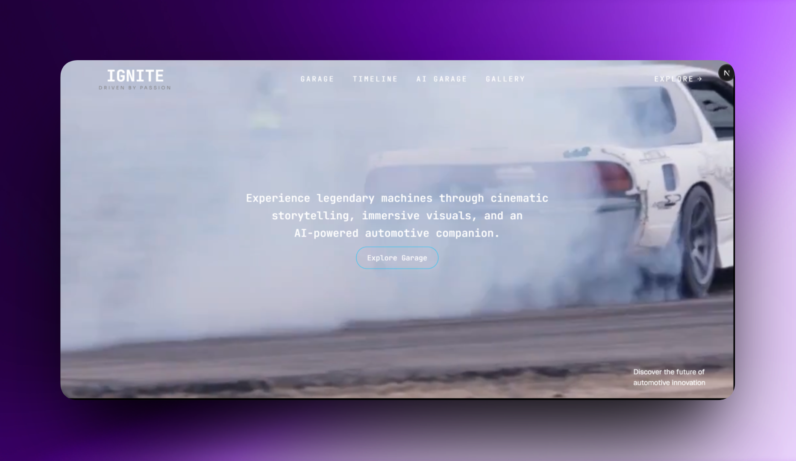

# 🚗 Passion Garage

> **A cinematic automotive experience powered by Google Gemini AI.**

Passion Garage is an immersive web experience built for the **DEV Weekend Challenge: Passion Edition**. Inspired by the passion behind legendary performance cars, the project combines cinematic storytelling, smooth GSAP animations, and an AI-powered automotive assistant to create a unique journey for car enthusiasts.



---

## ✨ Features

* 🎬 Cinematic scroll-driven storytelling
* 🚘 Featured performance cars
* 📖 BMW Story experience
* 🤖 AI Garage powered by Google Gemini
* ⚡ GSAP & ScrollTrigger animations
* 📱 Fully responsive design
* 🌙 Modern dark UI inspired by premium automotive brands
* 🚀 Built with the latest Next.js App Router

---

## 🤖 AI Garage

AI Garage is an intelligent automotive assistant built using **Google Gemini**.

Users can:

* Compare performance cars
* Learn about engines and horsepower
* Get buying recommendations
* Explore automotive technologies
* Ask questions about BMW, Porsche, Ferrari, Nissan, Audi, Toyota, Mercedes-Benz, Lamborghini, McLaren, and more

---

## 🛠 Tech Stack

### Frontend

* Next.js
* React
* TypeScript
* Tailwind CSS

### Animation

* GSAP
* ScrollTrigger

### Artificial Intelligence

* Google Gemini API

### Deployment

* Vercel

---

## 🚀 Getting Started

Clone the repository.

```bash
git clone https://github.com/rafiqwe/passion-garage-ai.git
```

Go into the project.

```bash
cd passion-garage-ai
```

Install dependencies.

```bash
npm install
```

Create an environment file.

```env
GEMINI_API_KEY=YOUR_API_KEY
```

Start the development server.

```bash
npm run dev
```

Open your browser.

```text
http://localhost:3000
```

---

## 📂 Project Structure

```text
app/
components/
public/
hooks/
lib/
styles/
```

---

## 💡 Inspiration

The theme for the DEV Weekend Challenge was **Passion**.

To me, passion is what drives engineers, designers, racers, and enthusiasts to build extraordinary machines.

Passion Garage was created to celebrate that emotion through cinematic storytelling and interactive technology.

---

## 🎯 Challenge Submission

This project was built for:

**DEV Weekend Challenge – Passion Edition**

Prize Category:

🏆 Best Use of Google AI

---

## 🌍 Live Demo

👉 https://passion-garage.vercel.app/

---

## 💻 GitHub

👉 https://github.com/rafiqwe/passion-garage-ai

---

## 👨‍💻 Author

**Muhammad Rabbi**

Full Stack Developer

* GitHub: https://github.com/rafiqwe
* Portfolio: https://muhammadrabbi.vercel.app

---

## 📄 License

This project is licensed under the MIT License.

---

## ❤️ Acknowledgements

* DEV Community
* Google Gemini
* GSAP
* Next.js
* Vercel

---

⭐ If you enjoyed this project, consider giving it a star!
